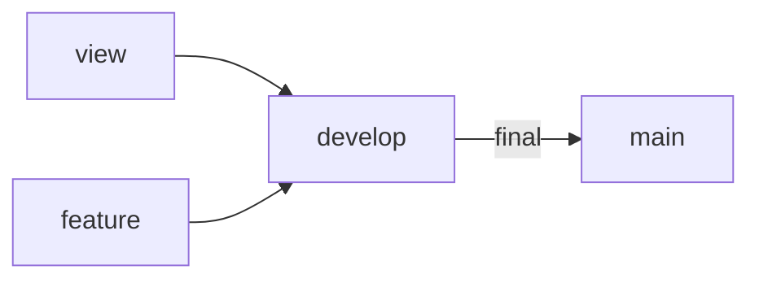
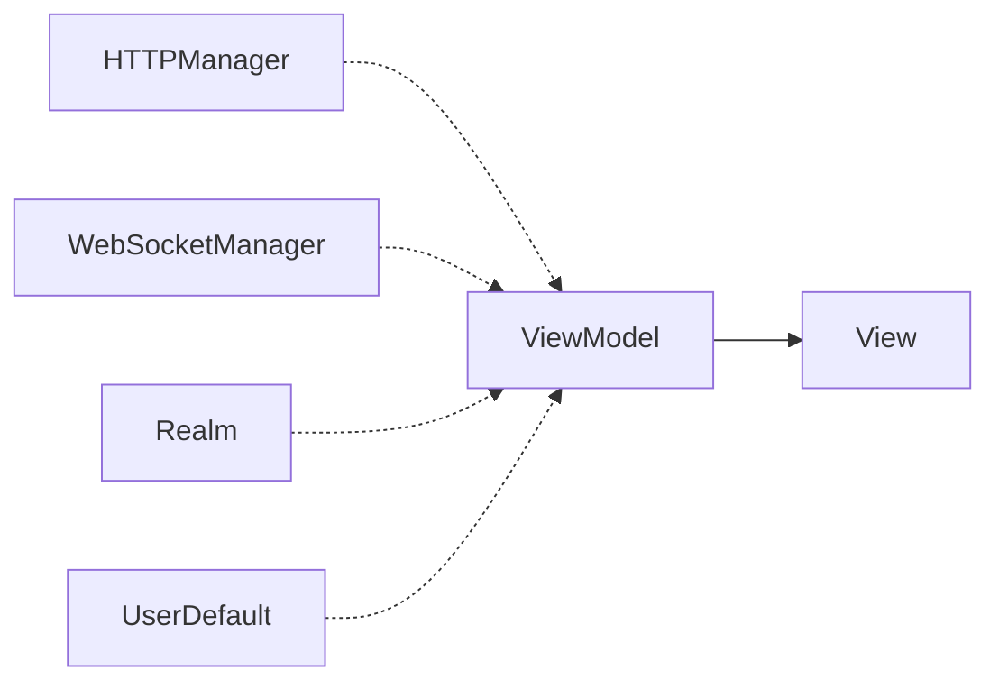

# Yathumb

<div align="left">
  
  
</div>

## 목차

* <a href="#팀원-소개">팀원 소개</a>
* <a href="#프로젝트-개요">프로젝트 개요</a>
* <a href="#프로젝트-상세-기능">프로젝트 상세 기능</a>
* <a href="#아키텍처-구성도">아키텍처 구성도</a>
* <a href="#기술-스택">기술 스택</a>
* <a href="#Convention">Convention</a>
* <a href="#Git-Flow">Git Flow</a>
* <a href="#App-Flow-Chart">App Flow Chart</a>
* <a href="#Directory-Structure">Directory Structure</a>

## 팀원 소개
|[Paul](https://github.com/ParkHyeongSeok)|[Henry](https://github.com/haeseoklee)|[Davy](https://github.com/db97828)|
| :-: | :-: | :-: |
|  |  |  |

### 맡은 기능

* **Paul(폴)**: 메인 & 입출금
* **Henry(헨리)**: 상세 정보 & 차트
* **Davy(다비)**: 호가 & 시세


## 프로젝트 개요

본 프로젝트는 [빗썸 테크 캠프 iOS 코스 1기](https://www.yagom-academy.kr/bithumb-tech-camp) 최종 과제로 진행되었습니다.

프로젝트 기간 (2022년 2월 21일 ~ 2022년 3월 13일)


## 프로젝트 상세 기능

### 메인 & 입출금

| 메인 | 관심 | 변동률기간 |
| :-: | :-: | :-: |
||||

| 코인검색 | 로그인 | 입출금현황 |
| :-: | :-: | :-: |
||||


#### 🔴 요구 사항

**메인**

  - 메인 레이아웃에 코인 목록, 관심, 인기 등을 표시
  - 관심은 코인 목록에서 사용자가 ON/OFF 가능
  - 인기는 활발한 체결 순으로 결정

**입출금**

* 가상 자산의 입/출금 현황 정보를 표시한다.

#### 🟢 구현 사항

**메인**

- [x] 원화, 인기, 관심을 나타내는 SpreadsheetView를 구현
  - 상단 바를 custom으로 구현, 해당 페이지가 눌렀을 때 API를 호출
  - 각 코인에 `관심(별)을 표시`할 수 있도록 구현해, 관심 탭에서 볼 수 있도록 구현
  - Star를 UserDefault와 연계해, 별의 상태와 관심 내역이 동기화되도록 구현
  - 인기를 누적 거래량 순으로 정렬해 활발한 체결 구현
  - 가산자산명, 현재가, 변동률, 거래금액을 기준으로 `정렬`할 수 있도록 구현
  - `코인 검색 기능`을 추가해, 심볼(BTC)를 입력하면 해당 데이터를 받아와 보여지도록 구현
- [x] 거래가 이뤄지는 코인은 `실시간으로 업데이트 상황이 반영`되도록 구현
  - HTTP와 WebSocket 통신을 활용해 `최신 데이터를 실시간으로 갱신 및 바인딩`
  - 현재가가 전의 가격보다 오른 경우 빨간색, 내린 경우 파란색` 애니메이션 구현`
  - `변동률 기간(24시, 어제대비 등)을 변경`하는 뷰를 구성하고, WebSocket에 반영하어 해당 데이터를 받아오도록 구현

**입출금**

- [x] 입출금 가능 여부 상태를 반영하는 뷰 구현
- [x] 런치스크린 및 로그인 화면을 구현해, 현재 사용자의 이름과 보유자산을 기입하도록 구현
- [x] 유저 정보, 보유재산을 기준으로 한 코인별 투자 비율 계산 및 반영

### 상세 정보 & 차트

|                       상세 정보 & 차트                       |                       상세 정보 & 차트                       |
| :----------------------------------------------------------: | :----------------------------------------------------------: |
|  |  |

#### 🔴 요구 사항

* 코인 실시거래가 그래프
  코인 선택 시, 그래프로 가격변동률 실시간 또는 1분/10분/30분/1시간/일 표시
  (표시되는 데이터는 로컬 DB 사용해서 관리)

#### 🟢 구현 사항

**상세정보**

- [x] 상단 헤더에 현재가, 변동금액, 변동률을 표시하고 상승/하락에 따라 색을 나타냄.

- [x] 네비게이션 바에 상단 오른쪽에 관심 코인 여부를 설정할 수 있는 별 버튼 기능을 추가.

- [x] 호가, 차트, 시세 화면을 상단 탭으로 구성.

**차트**

- [x] 실시 거래가 그래프의 시간 필터 옵션을 선택할 수 있는 버튼을 구현.
  * `10가지` 시간 필터 옵션 구현.
    (1분, 3분, 5분, 10분, 30분, 1시간, 6시간, 12시간, 24시간, 일 단위)

- [x] 선택한 코인에 해당하는 실시거래가 그래프 표시.

  * 상하 레이아웃으로 구성.


  * 중간 바를 위아래로 움직이는 `팬 제스처`를 통해 상하 그래프의 크기 조절 기능.

  * `핀치 줌 제스처`를 통해 그래프를 확대 축소 기능.

  * `좌우 스크롤 제스처`를 통해 그래프 시점 이동 기능.

  * 제스처에 따른 상하 그래프 동기화 기능.

  * 상단에는 `Candlestick 그래프`를 통해 시가, 종가, 고가, 저가 표시.

  * 또한 상단에는 `Line 그래프`를 통해 종가를 기준으로 이동 평균선 (MA5, MA10, MA20, MA60, MA120)를 표시.

  * 하단에는 `Bar 그래프`를 통해 거래량을 표시.

  * 또한 하단에는 `Line 그래프`를 통해 거래량를 기준으로 이동 평균선 (MA5, MA10, MA20, MA60, MA120)를 표시.

  * `Candlestick 그래프`와 `Bar 그래프`의 오른쪽 Y축에 `웹 소켓`으로 가져온 실시간 정보(시가, 종가 고가, 저가, 거래량) 표시.

  * Realm을 사용하여 받아온 데이터를 `데이터베이스`에 저장.

### 호가 & 시세

|                             호가                             |                             시세                             |
| :----------------------------------------------------------: | :----------------------------------------------------------: |
|  |  |

#### 🔴 요구 사항

**호가**

  - 매수(bid)/매도(ask) 영역을 리스트로 분리해서 실시간으로 표시

**시세**

* 시세창 구현하기(체결내역)

- 체결내역을 리스트로 표시한 후, 실시가능로 변경사항 업데이트

#### 🟢 구현 사항

**호가**

- [x] 매수/매도 영역을 리스트로 분리해서 실시간으로 표시
  * 가격과 전날일비 등락률을 계산해서 실시간으로 반영되도록 구현
  * 잔량과 잔량에 따른 barChart width를 실시간으로 반영되도록 구현
  * 현재가와 비교하여 border가 표시되도록 구현
  * 전날대비 가격이 (-)면 파란색, (+)면 빨간색으로 글씨를 표시
- [x] 체결내역 실시간으로 표시
  * 체결 강도를 실시간으로 반영되도록 구현
  * 체결내역을 실시간으로 반영되도록 구현
  * 처음 받아 온 데이터는 이전 데이터와 비교해 (-)면 파란색, (+)면 빨간색으로 표시되도록 구현
  * webSocket데이터는 upDn값에 따라 글씨색을 다르게 표시되도록 구현
- [x] 현재가 정보 표시
  * 거래량, 거래금 표시
  * 전일종가, 시가, 고가, 저가 표시

**시세**

- [x] 체결내역 리스트로 표시

  * 시간, 가격, 체결량 형식 맞춰서 실시간으로 데이터가 반영되도록 구현

  * 이전 가격과 비교해서 글씨색 다르게 표시되도록 구현

## 기술 스택

### Language & IDE
* Swift
* Xcode 13

### UI
* SnapKit
* Then
* SpreadsheetView
* XLPagerTabStrip
* PanModal
* Charts

### Architecture
* MVVM

### Reactive Programming
* RxSwift
* RxCocoa
* RxDataSource
* RxGesture
* RxViewController
* RxOptional

### Network
* Moya
* Alamofire
* Starscream

### Database
* Realm


## Convention

* PR에는 Description과 구현 이미지, 관련 이슈를 작성하는 Convention을 사용했습니다.
* commit은 [Karma Commit Convention](http://karma-runner.github.io/6.3/dev/git-commit-msg.html)을 따랐습니다.
* [SwiftLint](https://github.com/realm/SwiftLint)를 사용하여 Code Convention을 맞추었습니다.
* StyleShare의 [Swift Style Guide](https://github.com/StyleShare/swift-style-guide)를 참고하였습니다.
* 팀내에 원활한 협업을 위해 [GroundRules]( https://github.com/Bithumb-Tech-Camp/Bithumb-Project/wiki/Ground-Rules) 를 작성하였습니다.


## Git Flow



## App Flow Chart


## Directory Structure

```text
BithumbProject
├── Soureces
│   ├── Application
│   │   └── AppDelegate.swift
│   │   └── SceneDelegate.swift
│   ├── Models
│   ├── Network
│   ├── ViewModels
│   ├── Views
│   │   ├── Detail
│   │   │   ├── Transaction
│   │   │   ├── OrderBook
│   │   │   └── Chart
│   │   └── Main
│   │       ├── Login
│   │       ├── Exchange
│   │       ├── Holdings
│   │       └── CustomView
│   └── SupportingFiles
│       ├── Errors
│       ├── Protocols
│       ├── Constants
│       └── Extensions
└── Resources
    ├── Assets
    ├── LaunchScreen.storyboard
    └── Info.plist

```
