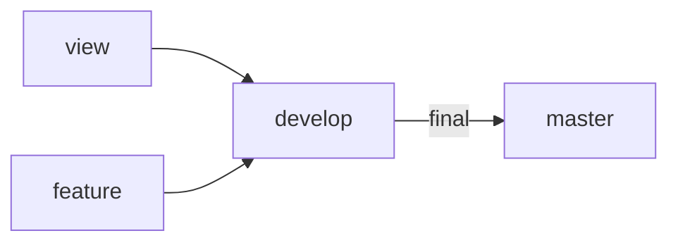
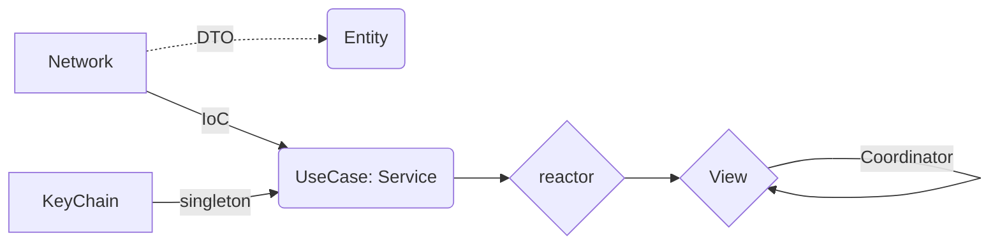

# Yathumb

## 목차

* <a href="#팀원-소개">팀원 소개</a>
* <a href="#프로젝트-개요">프로젝트 개요</a>
* <a href="#프로젝트-상세기능">프로젝트 상세 기능</a>
* <a href="#아키텍처-구성도">아키텍처 구성도</a>
* <a href="#Skills">Skills</a>
* <a href="#Convention">Convention</a>

## 팀원 소개
|[Davy](https://github.com/db97828)|[Henry](https://github.com/haeseoklee)|[Paul](https://github.com/ParkHyeongSeok)|
| :-: | :-: | :-: |
|  |  |  |

## 프로젝트 개요


## 프로젝트 상세 기능

### 코인 목록 화면 & 입출금 화면

| 메인 | 관심 | 변동률기간 |
| :-: | :-: | :-: |
||||

| 코인검색 | 로그인 | 입출금현황 |
| :-: | :-: | :-: |
||||

1. 코인 목록, 인기, 관심 표시
* 원화, 인기(거래량 기준), 관심(별표)를 표시하는 SpreadsheetView를 구현했습니다.
* 거래가 이뤄지는 코인은 `실시간으로 업데이트 상황이 반영`(코인 데이터(실거래가, 변동률 등) 변경 및 오른 경우 빨간색, 내린 경우 파란색 애니메이션)되도록 구현했습니다.
* 가산자산명, 현재가, 변동률, 거래금액을 기준으로 `정렬`할 수 있도록 구현했습니다.
* `변동률 기간(24시, 어제대비 등)을 변경`하는 뷰를 구성하고, 웹소켓에 반영하어 각각 다른 데이터를 받아오도록 구현했습니다.
* `코인 검색 기능`을 추가해, 심볼(BTC)를 입력하면 해당 데이터를 받아와 보여지도록 구현했습니다.
* 각 코인에 `관심(별)을 표시`할 수 있도록 구현해, 관심 탭에서 볼 수 있도록 구현했습니다.

2. 입출금 현황
* 런치스크린 및 로그인 화면을 구현해, 현재 사용자의 이름과 보유자산을 기입하도록 구현했습니다.
* 유저 정보, 보유재산을 기준으로 한 코인별 투자 비율, 입출금 가능 여부 상태를 반영하는 뷰를 구현했습니다. 


### 상세 정보 & 차트
코인 실시거래가 그래프
코인 선택 시, 그래프로 가격변동률 실시간 또는 1분/10분/30분/1시간/일 표시
(표시되는 데이터는 로컬 DB 사용해서 관리)

### 호가 & 시세

호가정보창 구현하기
매수(bid)/매도(ask)
매수/매도 영역을 리스트로 분리해서 실시간으로 표시

체결내역 표시하기
체결내역을 리스트로 표시한 후, 변경사항이 있을 때 업데이트

## Skills
### Language & IDE
* Swift
* Xcode 13

### UI
* SnapKit
* Then
* SpreadsheetView
* XLPagerTabStrip
* PanModal
* Charts

### Architecture
* MVVM

### Reactive Programming
* RxSwift
* RxCocoa
* RxDataSource
* RxGesture
* RxViewController
* RxOptional

### Network
* Moya
* Alamofire
* Starscream

### Database
* Realm

## Convention
* PR에는 Description과 구현 이미지, 관련 이슈를 작성하는 Convention을 사용했습니다.
* commit은 Karma Commit Convention을 따랐습니다.
* SwiftLint와 StyleShare 코드 컨벤션을 사용했습니다.
* GroundRules : https://github.com/Bithumb-Tech-Camp/Bithumb-Project/wiki/Ground-Rules

## Git Flow


### App FlowChart

### 디렉토리 구조
```text
Bithumb-Tech-Course
├── Soureces
│   ├── App
│   │   └── AppDelegate.swift
│   │   └── SceneDelegate.swift
│   ├── Models
│   ├── Domains
│   ├── Repositories
│   ├── ViewModels
│   ├── Views
│   ├── Utils
│   └── Constants
└── Resources
    ├── Assets
    ├── LaunchScreen.storyboard
    ├── Info.plist
    └── Localizable.strings

```
