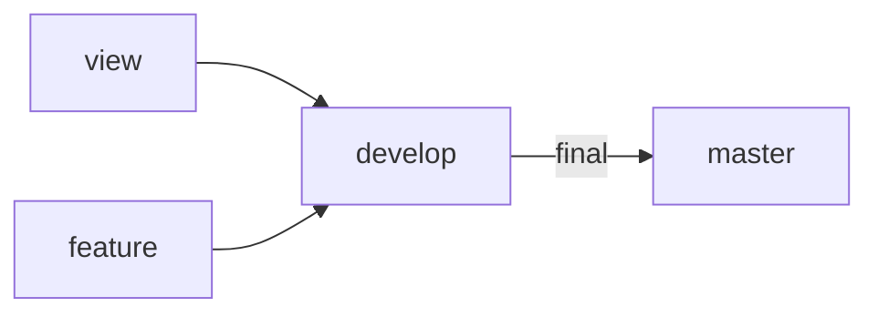
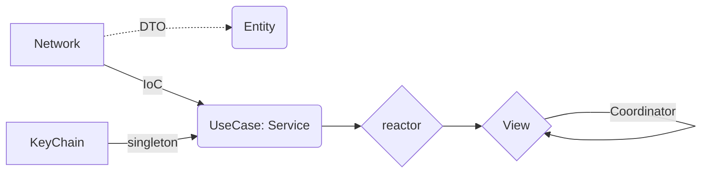

# Yathumb

## 목차

* <a href="#팀원-소개">팀원 소개</a>
* <a href="#프로젝트-개요">프로젝트 개요</a>
* <a href="#프로젝트-상세기능">프로젝트 상세 기능</a>
* <a href="#아키텍처-구성도">아키텍처 구성도</a>
* <a href="#Skills">Skills</a>
* <a href="#Convention">Convention</a>

## 팀원 소개
|[Davy](https://github.com/db97828)|[Henry](https://github.com/haeseoklee)|[Paul](https://github.com/ParkHyeongSeok)|
| :-: | :-: | :-: |
|  |  |  |

## 프로젝트 개요


## 프로젝트 상세 기능

### 메인 & 입출금
메인화면
메인 레이아웃에 코인 목록, 관심, 인기 등을 표시합니다.
코인 목록은 빗썸 PC 참조
관심은 코인 목록에서 사용자가 ON/OFF 가능
인기는 활발한 체결 순으로 결정

코인 실거래가 표시하기
코인별 리스트로 현재가 및 변동률 표시하기

입출금 현황
가상 자산의 입/출금 현황 정보를 표시한다.

### 상세 정보 & 차트
코인 실시거래가 그래프
코인 선택 시, 그래프로 가격변동률 실시간 또는 1분/10분/30분/1시간/일 표시
(표시되는 데이터는 로컬 DB 사용해서 관리)

### 호가 & 시세

호가정보창 구현하기
매수(bid)/매도(ask)
매수/매도 영역을 리스트로 분리해서 실시간으로 표시

체결내역 표시하기
체결내역을 리스트로 표시한 후, 변경사항이 있을 때 업데이트

## Skills
### Language & IDE
* Swift
* Xcode 13

### UI
* SnapKit
* Then
* SpreadsheetView
* XLPagerTabStrip
* PanModal
* Charts

### Architecture
* MVVM

### Reactive Programming
* RxSwift
* RxCocoa
* RxDataSource
* RxGesture
* RxViewController
* RxOptional

### Network
* Moya
* Alamofire
* Starscream

### Database
* Realm

## Convention
* PR에는 Description과 구현 이미지, 관련 이슈를 작성하는 Convention을 사용했습니다.
* commit은 Karma Commit Convention을 따랐습니다.
* SwiftLint와 StyleShare 코드 컨벤션을 사용했습니다.
* GroundRules : https://github.com/Bithumb-Tech-Camp/Bithumb-Project/wiki/Ground-Rules

## Git Flow


### App FlowChart

### 디렉토리 구조
```text
Bithumb-Tech-Course
├── Soureces
│   ├── App
│   │   └── AppDelegate.swift
│   │   └── SceneDelegate.swift
│   ├── Models
│   ├── Domains
│   ├── Repositories
│   ├── ViewModels
│   ├── Views
│   ├── Utils
│   └── Constants
└── Resources
    ├── Assets
    ├── LaunchScreen.storyboard
    ├── Info.plist
    └── Localizable.strings

```
